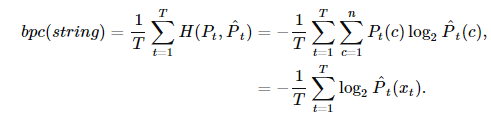
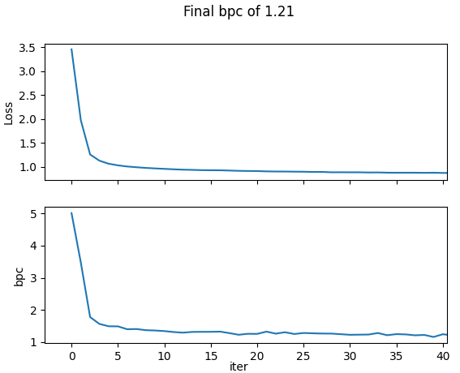
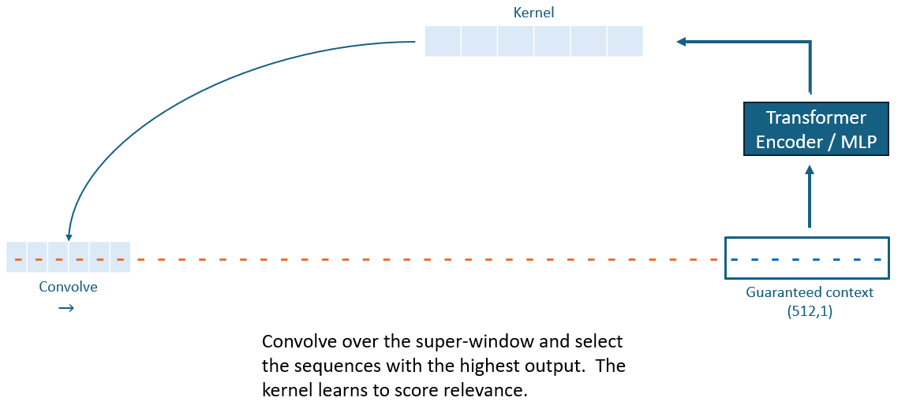

# Novel Additions to GPT to Improve Compression on enwik8 

  In this work, we want to take a crack at character-level modeling by training and evaluating on the [enwik8](https://mattmahoney.net/dc/textdata.html) dataset, a widely used benchmark for evaluating LLMs and their ability to perform language compression.  More specifically, enwik8 is the first 10e9 bytes of the English Wikipedia dump on Mar. 3, 2006

## Intro

To begin, I pulled Andrei Karpathy's [NanoGPT](https://github.com/karpathy/nanoGPT) as the boilerplate model / codebase.  My background is primarily outside of NLP, so I will shoot from the hip on some of my novel ideas :)
  - *Data loading* - I downloaded enwik8 dataset and cleaned it down to a subset of characters.  Using [wikifil.pl](sky-nanoGPT/data/enwik8/wikifil.pl) from the Enwik website, I removed all special characters and only kept Alphanumeric and spaces.  We spell out our numbers.  Thus a vocab of 27 characters, rather than thousands in the original dataset. We are left with a dataset of length 74 MM characters. To load data and run this on your end, simply enter sky-nanoGPT directory and do the following.

```
pip install -r requirements.txt
perl wikifil.pl enwik8 > input.txt
python ./data/enwik8/prepare.py
```

  - *Calculation of bpc* - We employ the equation from the figure below.  $P_t$ is found by applying a softmax to the transformer's output at time step t and taking the resultant probability of the ground-truth associated logit.  This number is calculated over a large input string of T characters.  We compute this during validation by adding the lines in estimate_loss(), 

```
for k in range(eval_iters):
    X, Y = get_batch(split)
    logits, loss = model(X, Y)

    softmaxed = softmax(logits[:,-1,:])
    prob_truechar = [np.log2(softmaxed[i][Y[i,-1]] for i in range(softmaxed.shape[0])]
    bpc -= mean(prob_truechar)
```

## Training a baseline of NanoGPT on the dataset.  

This model was *Nano*, and I altered the architecture to 8 transformer layers of 8 attention heads.  We use a context size of 1028.  We perform an ablation study with context size (figure below).  _Large context sizes provide significant improvments, particularly in character-level modeling where dependencies can be stretched over thousands of characters._  More on this later. 

| Context Size | bpc |
| --- | --- |
| 256 | 1.35 |
| 512 | 1.26 |
| 1024 | 1.21 |

We converge around 1.21 bpc, with loss and bpc curves below.  



*loss snd bpc evolving over the validation runs, which happens every 250 train iterations.  Plotting code implemented here, [Line 42](sky-nanoGPT/utils.py)


## Experimental Improvements 

#### 1. Vowel-Consonant encodings

We know that in language, we know that a long succession of consonants do not occur.  Thus $P_{vowel}$ is conditionally dependent on the constituent makeup of nearby characters.  With more nearby consonants, $P_{vowel}$ increases.  To exploit this knowledge, we create a corresponding vowel/consonant/other encoding of our input strings.  The assignments are 

- $\large +\epsilon$ for vowels

- $\large -\epsilon$ for consonants
 
- $\large 0$ for spaces and numbers

Additionally, similar to the paper https://arxiv.org/abs/1808.04444 that was referenced in the assignment, we may re-introduce these encodings at intermediate blocks.  We always add this enconding initially, and can optionally re-add at every-other transformer block.  We create some tooling to create encodings and more in utils.py. [Line 20](sky-nanoGPT/utils.py). To add the encoding into the forward pass of GPT, we simply replace the line. This code is shown here [Line 263](sky-nanoGPT/model.py)

```
x = self.transformer.drop(tok_emb + pos_emb)
```
```
from utils import pos_embed_vowel_consonant
vowel_cons_embed = pos_embed_vowel_consonant(idx, self.config.vowel_cons_embed_weight) #(b, t)
x = self.transformer.drop(tok_emb + pos_emb + vowel_cons_embed.unsqueeze(-1))
```

We do not observe any real benefits using this method.  With  $\epsilon = 0.05$ , **bpc = 1.23** Testing with multiple $\epsilon$ values, we find that  
$$\lim_{\varepsilon \to 0} loss(\varepsilon) = loss_{baseline}$$

The fact that this occurs monotonically for all $\epsilon > 0$, proves this technique only adds unecessary noise to our system. 
 - _Thought_: While I am a bit perplexed that it _degraded_ performance, I think it is reasonable to expect very little benefit.  Since we are using learned embeddings for the positional encodings, the learned embeddings should learn to exploit the vowel-consonant phenomena of language.

#### 2. Massively Increase Context Window -- Downselect Only Relevant Sequences before GPT

As shown before, context size has a huge contribution to model perplexity.  However, the complexity of a transformer scales quadratically with the length of input tokens, therefore it becomes infeasible to continually increase context size.  There will be diminishing returns here, and perhaps it will be a big lift to squeeze out the remaining opportunity, but when every 0.01 in bpc matters, it may be worth it.  

To do this, I want to increase the possible context size to something huge (4096, 8192), and then have the network learn where to attend -- we want to _downselect_ the relevant context and feed this into the transformer, such that input token length remains untouched. We introduce a custom block for this, which we can call RelevanceSelector ([Line 20](sky-nanoGPT/model.py)).  No-grad convolution is implemented [here, Line 105](sky-nanoGPT/utils.py).  We first feed a super-window to the model (length 4096, 8192, or etc) and allow RelevanceSelector to infer the most relevant sequences of information (of length kernel_size).  In the schematic below, we start with a super window of 4096.  We guarantee the most recent 512 characters will be selected. Then search for the 512 most relevant remaining characters to form our final context window of 1024.  



We add this to the GPT forward pass, immediately before token / position embedding.  We simply add the line in model.py [Line 256](sky-nanoGPT/model.py)
```
idx = self.RelevanceSelector(idx)
```

Training with this method, we receive a bpc of 1.31.  So, we have only lost against our baseline.  However, there are several reasons why I think this.  With more time I would like to explore all of these.

1. I oversimplified (for sake of simplicity) the kernel-producing network.  In my training, I only made this a 2-layer MLP, when the encoding of the guaranteed context should be more sophisticated to properly understand context and concept.  A transformer encoder would do this more justice.
2. Although we are choosing scattered sequences across the super-window, I did not implement logic yet that will properly handle positional encodings.  Thus, the network has no way of relating the sequence's original position relative to the current timestep.  This is a substantial short-coming that must be resolved in the future.
3. We are unecessarily eliminating information.  I realized this a bit late, but perhaps a more clever strategy is to combine all the information in the super-window.  Rather than downselecting, why not _encode all of it_ and combine?  I dug into some literatue and found the following: Google's [_Leaving No Context Behind_](https://arxiv.org/html/2404.07143v1) recently did something just like this.  Compresses all information in the distant past and feeds this to the network, such that we haven't lost any information.  With more time, I would love to take a whack at this.
4. I use argsort() as the method to select the most relevant sequences (which I was concerned about because it isn't differentiable).  Because of this, we only backpropogate using our selected sequence.  I think more efficient training can emerge if we could select all possible sequences and backpropogate.  With this method, we not only get signal on how well our selected sequence worked, but we get information on how well _we could have_ done with other candidate sequences.  This may be a moot point, but I need to think more about this.  

I think this is a fun and promising idea that would require a bit more time to build out.  
 
#### 3. Adding auxillary task of predicting further into the future 

To convey this idea, lets consider world-level modeling for a moment. Consider the sentence

|   Context   | Logits |
| --- | --- |
|_Do you remember when Michael Jordan dunked_ __   |  (_that one time_: 10%, _in the championship game_: 5%,  _on him_: 12%,   _from far away_:  3%)|

There are many possible endings to the sentence.  **But what if you knew the following word with high confidence**?
          
|       Context               |             Logits|
| --- | --- |
| _Do you remember when Michael Jordan dunked_ __ _him_    |   (_on_ 60%,  _over_ 20%, _from_ 10%) |

Suddenly, the additional context dramatically reduces our perplexity and cross entropy (most of our confidence is in a small set of words).  The logic here is as follows: 

- _Logic_: If you can learn to model on a _conceptual level_, understanding what the speaker is generally discussing, you may be able to infer the next word with more confidence (this can be done within the causal structure -- we do not require future predictions for this task).

- _Suspicion_: It's not immediately clear to me how the context provides higher confidence about the far-future than nearer future, particularly not at the specific word level.  However, maybe our probability distribution over the space of all possible words, within the space of the identified (likely) concept, is enough to meaningfully update the immediate future distribution.

- _Suspicion_: At the character level this task becomes even more difficult.

So we implement this in our character-level model by forcing the model to predict the next three or four characters.  We update the train loaders, loss calculation, and bpc calculation to accomodate this change, by creating a programmable parameter _future_window_length_ to control how far into the future we forecast.  This parameter is set in [train_enwik.py](sky-nanoGPT/config/train_enwik8.py) and code changes occur in several spots [Line 149](sky-nanoGPT/train.py) [Line 95](sky-nanoGPT/utils.py) [Line 283](sky-nanoGPT/model.py)

### Ablation Studies on Implemented Ideas

All experiments are run 3 times, using the baseline architecture and context window size. 

| Experiment | bpc |
| --- | --- |
| Baseline | 1.21 |
| Vowel-Consonant Encoding | 1.23 |
| Relevance Selector | 1.31 |
| Predicting Four Characters Ahead | 1.26 |

With all this said, I never got any improvements over baseline.  I do have most confidence in the potential of Relevence Selector, however I need more time to build on it, particularly so that positional information is retained when selecting candidate sequences to include in the input context.  Overall, I learned a LOT in this problem, and it was tremendously fun. 


